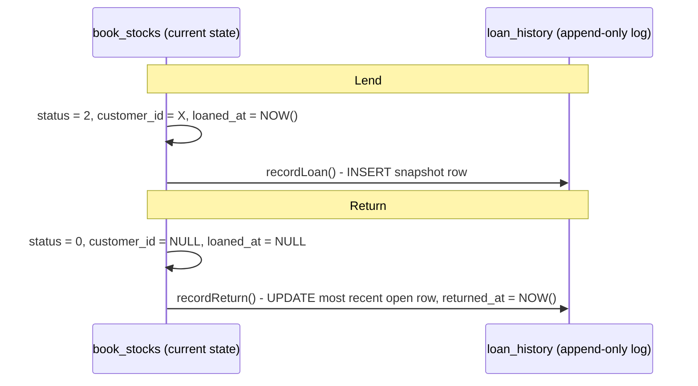

# Loans

A read-only view over lending activity: what's currently out, and a full
historical report of every loan ever made. If [CUSTOMERS.md](CUSTOMERS.md)
is about *doing* a lend/return, this is about *listing and reporting on*
them afterward.

## Contents

- [`book_stocks` vs. `loan_history`](#book_stocks-vs-loan_history)
- [Currently on loan](#currently-on-loan)
- [The loan history report](#the-loan-history-report)
- [Where this lives in code](#where-this-lives-in-code)

## `book_stocks` vs. `loan_history`

Two tables, two different jobs:

- **`book_stocks`** knows the *current* state only. `status = 2` +
  exactly one of `customer_id` (a customer) or `member_user_id` (a vault
  member with borrow permission) = "on loan to them right now." Once
  returned, `customer_id`/`member_user_id`/`loaned_at` are wiped - there's no way to ask `book_stocks`
  "who had this book last March."
- **`loan_history`** is an append-only log, one row per loan, written
  alongside every `book_stocks` transition into/out of `BOOKED` (see
  [`LoanHistory.ts`](../server/src/utils/LoanHistory.ts), called from both
  `BooksRoute.ts` and `CustomerRoute.ts`). Each row snapshots only the book
  name; the borrower is referenced by `customer_id` or `member_user_id`
  (exactly one, enforced by a CHECK) plus `group_id` (always NULL for
  members), and names are read through those ids - so a rename shows up in
  every report. Deleting a customer or user deletes their loan history
  (`ON DELETE CASCADE`).

`recordLoan`/`recordReturn` must be called by every code path that changes
`book_stocks.status` into or out of `2` - forgetting one leaves the current
state correct but the history silently incomplete, so if you add a new way
to lend/return a book, wire this in too.

## Currently on loan

`GET /loans` ([`LoansRoute.ts`](../server/src/routes/LoansRoute.ts)) lists
every `book_stocks` row with `status = 2`, paginated (50/page), filterable
by customer group and a loan-date range, newest first. This reads
`book_stocks` directly (not `loan_history`) since it only cares about *now*.

Returning a book from this list reuses the existing
`POST /book/return` endpoint (see [BOOKS.md](BOOKS.md)) - `LoansRoute.ts` is
deliberately listing-only, no mutation endpoints of its own.

## The loan history report

`GET /loans/report` is the export behind the Loans view's Excel report:
every loan (returned or still open) in a **required** date range, optionally
narrowed by customer group and/or a single customer. Backed by
`loan_history`, so returned loans show up too - unlike `GET /loans`, this is
how you'd answer "how many books did Class 4B borrow last semester."

`date_from`/`date_to` are required (400 if either is missing) - this
endpoint is meant for a bounded report, not a full-table dump.

## Where this lives in code

| Concern | File |
|---|---|
| Currently-on-loan listing, history report | `server/src/routes/LoansRoute.ts` |
| `loan_history` read/write helpers | `server/src/utils/LoanHistory.ts` |
| Lend/return actions (mutate `book_stocks` + call the helpers above) | `server/src/routes/CustomerRoute.ts`, `server/src/routes/BooksRoute.ts` |
| `loan_history`/`book_stocks` schema | `assets/db/databaseSchema.sql` |
| Client: `/loans` HTTP client | `client/src/service/loans/LoansService.ts` |
| Client: page controller | `client/src/controller/loans/LoansController.ts` |
| Client: loans page UI + Excel export | `client/src/views/loans/LoansView.vue`, `LoanReportDialog.vue`, `components/ReturnBooksDialog.vue` |
